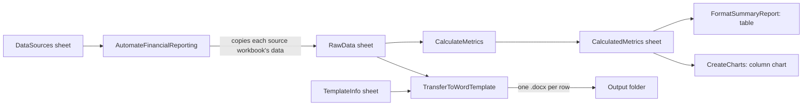

# Contract Automation

This project came out of a process a small Dallas valuations firm wanted: pull
monthly revenue and expense data out of a folder of client workbooks, compute
a few standard metrics, and fill a Word contract template per client without
retyping anything by hand. The values here have been anonymized and
simplified so as not to reproduce the original firm's data; everything in
`sample/` is generic, round, fake numbers.

Since there is no real contract template to build against, the macro here
writes its output straight to a `.docx` per row rather than into anything
further downstream. In a real deployment, these values would likely feed
inline into a templated legal document instead of standing alone.

I have since rebuilt the macro. The original shipped as two draft modules
with the same sub names, one of which does not compile (`Continue Do` is not
valid VBA), and the one that does compile fills the right bookmarks for the
first contract row and silently empties ones for every row after it, because
it reuses a single open Word document across the whole loop.

*The screenshot this repository's sample data is reconstructed from.*

## At a glance

| | |
|---|---|
| **Macro** | `src/ReportAutomation.bas` -- one module, five subs |
| **Inputs** | `DataSources` sheet (paths to source workbooks), `RawData` (consolidated rows), `TemplateInfo` (template path + output folder) |
| **Outputs** | `CalculatedMetrics` sheet with a table and a chart; one `.docx` contract per `RawData` row |
| **Validation** | 11 pytest tests: `metrics.py` pinned against the sample screenshot's numbers, including the zero-previous-revenue case; static checks on the `.bas` text itself |
| **Stack** | VBA (Excel + late-bound Word), Python for tests and the sample-data generator |

## What it does

`AutomateFinancialReporting` opens each workbook listed on `DataSources`,
copies its first sheet's data into `RawData`, then calls `CalculateMetrics`
(net profit, month-over-month revenue growth, profit margin, total revenue),
`FormatSummaryReport` (bold header, `ListObject` table), and `CreateCharts`
(a clustered column chart of net profit and revenue growth). Separately,
`TransferToWordTemplate` opens the template named in `TemplateInfo!B1`,
fills its bookmarks from each `RawData` row, and saves one contract per row
into the folder named in `TemplateInfo!B2`.

## Setup

1. Open the workbook in Excel, then Alt+F11 to open the VBA editor.
2. File > Import File..., and import `src/ReportAutomation.bas`. No reference
   to the Word object model is required -- `TransferToWordTemplate` creates
   Word with late binding (`CreateObject("Word.Application")`).
3. Save the workbook as macro-enabled, `.xlsm`.
4. Add four sheets, named exactly:
   - `DataSources` -- column A, from row 2 down: full paths to source workbooks.
   - `RawData` -- cleared and refilled by every run.
   - `CalculatedMetrics` -- filled by `CalculateMetrics` / `FormatSummaryReport` / `CreateCharts`.
   - `TemplateInfo` -- `B1` = path to the Word contract template, `B2` = output folder for generated contracts.
5. In the Word template, add bookmarks named `RegionBookmark`, `MonthBookmark`,
   `RevenueBookmark`, `ExpensesBookmark`, `NetProfitBookmark`,
   `CustomerNameBookmark`, `CompanyNameBookmark` wherever those values belong.
6. Run `AutomateFinancialReporting` to consolidate and compute metrics, then
   `TransferToWordTemplate` to generate the contracts.

`sample/FinancialReport_sample.xlsx` and `sample/ContractTemplate.docx` are a
ready-made example with this layout already filled in (`RawData` has 12
months of the same fake numbers as the screenshot above, and `TemplateInfo`
points at `ContractTemplate.docx` with relative paths you'll need to make
absolute). We can't ship a `.xlsm` generated from Python -- Excel's macro
project binary isn't something openpyxl can write -- so import
`src/ReportAutomation.bas` into the sample workbook yourself per the steps
above to try it end to end.

## Repository guide

| Path | Contents |
|---|---|
| `src/ReportAutomation.bas` | The consolidated, compiling module |
| `legacy/Financial_report_module.bas` | Original draft 1, annotated. Not imported; known broken |
| `legacy/finautomation_templateexceltoword.bas` | Original draft 2, annotated. Not imported; does not compile |
| `metrics.py` | Python mirror of `CalculateMetrics`, so its arithmetic can be pinned by tests |
| `sample/make_sample.py` | Regenerates the two sample files below |
| `sample/FinancialReport_sample.xlsx` | Sample workbook: `DataSources`, `RawData` (12 months), `TemplateInfo` |
| `sample/ContractTemplate.docx` | Sample Word template with all seven bookmarks |
| `tests/test_metrics.py` | Known-value tests against the sample screenshot's numbers |
| `tests/test_bas_lint.py` | Static checks on the `.bas` text: compiles cleanly, no duplicate subs, no hardcoded paths |
| `docs/img/result_image_sample.png` | The original buggy chart output |
| `finautomation_results.pdf` | The same output as a PDF |

## Notes

- `TransferToWordTemplate` runs Word invisibly (`wordApp.Visible = False`) and
  quits it in both the normal path and the error handler, so a failed run
  doesn't leave an orphaned `WINWORD.EXE` process.
- `EnsureFolderExists` creates the output folder one path segment at a time,
  since `MkDir` on its own fails if more than the last segment is missing.
- VBA can't run in CI, so `tests/test_bas_lint.py` only checks the text of
  `src/ReportAutomation.bas` -- it is not a substitute for opening the file in
  the VBA editor and compiling it.
